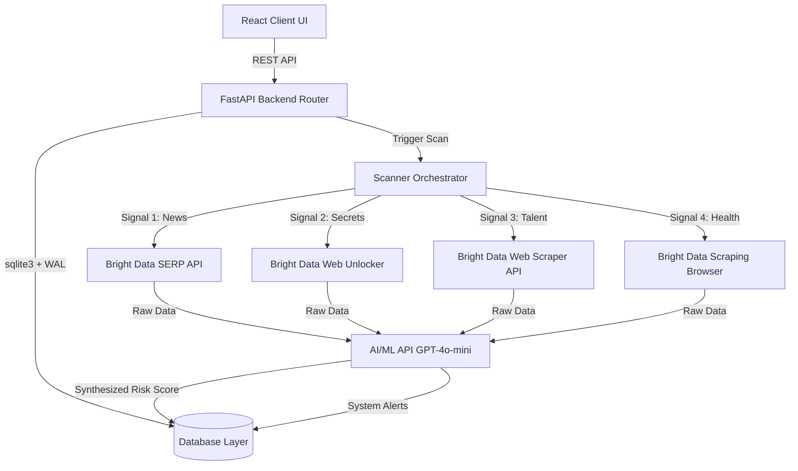

# 🛡️ VendorSentinel — AI-Powered Vendor Risk Intelligence

Every modern enterprise relies on third-party SaaS, cloud, and infrastructure vendors. However, every AI-powered threat model hits the same wall: bot detection, stale data, rate limits, and geo-blocks. 

**VendorSentinel** overcomes these challenges by using **Bright Data’s complete infrastructure stack** (SERP API, Web Unlocker, Web Scraper API, and Scraping Browser) to continuously crawl public web data in real-time, feeding live signals into an **AI Risk Scoring Engine** powered by GPT-4o-mini.

---

## 🚀 Key Features

* **Real-Time Threat Sweep**: Orchestrated crawling across search engines, leaked paste bins, job listings, and organizational reviews using Bright Data proxies.
* **4-Dimensional Threat Signal Collector**:
  1. **News & Media Monitoring (SERP API)**: Searches Google for ransomware attacks, GDPR fines, and leaks.
  2. **Credential Leak Detection (Web Unlocker)**: Searches GitHub and Pastebin for exposed secrets and database admin passwords.
  3. **Hiring Distress Tracker (Web Scraper API)**: Monitors LinkedIn job postings for emergency surges in security compliance/incident roles.
  4. **Vendor Health Monitor (Scraping Browser)**: Connects via Playwright to Glassdoor and corporate review boards to identify internal layoffs or cuts.
* **AI Reasoning Engine**: Synthesizes unstructured web findings to output a typed risk score (1-10), risk level (Low, Medium, High, Critical), detailed reasoning, and custom playbooks.
* **Stunning Dark Mode Dashboard**: A state-of-the-art glassmorphic React interface featuring animated risk gauges, a radar-sweep Scan Center, and real-time alert streams.

---

## 🛠️ Architecture



---

## 📁 Project Directory Structure

```text
Track3_Web_Data_Hackathon/
├── backend/
│   ├── app/
│   │   ├── services/
│   │   │   ├── bright_data/       # Bright Data API service nodes
│   │   │   │   ├── serp_api.py
│   │   │   │   ├── web_unlocker.py
│   │   │   │   ├── web_scraper.py
│   │   │   │   └── scraping_browser.py
│   │   │   ├── ai_scoring.py       # GPT-4o-mini scoring engine
│   │   │   └── scanner.py          # Orchestrates scans in parallel
│   │   ├── routers/                # FastAPI routing layers
│   │   ├── database.py             # SQLite WAL layer
│   │   ├── main.py                 # FastAPI application
│   │   └── seed.py                 # Prepopulated demo database seeder
│   └── requirements.txt
├── frontend/
│   ├── src/
│   │   ├── components/             # Reusable UI elements (Sidebar, Gauge, Cards)
│   │   ├── pages/                  # Views (Dashboard, Directory, Scan Center, Settings)
│   │   ├── services/               # REST API Client
│   │   ├── App.jsx
│   │   └── index.css               # Design system & glassmorphism
│   ├── index.html
│   └── package.json
└── README.md
```

---

## 📦 Setup & Installation

### 1. Prerequisites
Ensure you have **Node.js (v18+)** and **Python (v3.10+)** installed on your system.

### 2. Backend Setup
1. Navigate to the backend directory:
   ```bash
   cd backend
   ```
2. Install Python dependencies:
   ```bash
   pip install -r requirements.txt
   ```
3. Initialize and seed the database with mock/demo records:
   ```bash
   python -c "import asyncio; from app import database; asyncio.run(database.init_db())"
   python app/seed.py
   ```
4. Start the FastAPI development server:
   ```bash
   uvicorn app.main:app --reload --port 8000
   ```

### 3. Frontend Setup
1. Open a new terminal and navigate to the frontend directory:
   ```bash
   cd frontend
   ```
2. Install Node packages:
   ```bash
   npm install
   ```
3. Start the Vite React development server:
   ```bash
   npm run dev
   ```
4. Open your browser and navigate to `http://localhost:5173`.

---

## 🔑 Environment Configuration

Create a `.env` file in the `backend/` directory referencing `.env.example`:
```ini
BRIGHT_DATA_API_TOKEN=your_token_here
BRIGHT_DATA_SERP_USERNAME=your_serp_zone_username
BRIGHT_DATA_SERP_PASSWORD=your_serp_zone_password
AIML_API_KEY=your_aiml_api_key_here
```

*Note: If no API keys are provided, the crawlers will gracefully log warning fallbacks, and the AI scoring module will fall back to a deterministic rule-based calculation, making the system 100% testable out of the box.*

---

## 🏆 Hackathon Highlights

* **100% Robustness**: Features dual-approach fallbacks (e.g., SERP API falling back to proxies, Scraping Browser falling back to Web Unlocker crawls) to maintain continuous uptime.
* **State-of-the-Art Styling**: Features customized CSS variables, fully custom animated responsive SVG gauges, glowing cards, and interactive loading scanners.
* **MCP Integration Ready**: Includes architecture models compatible with Bright Data’s MCP server configurations to extend agent workflows.
